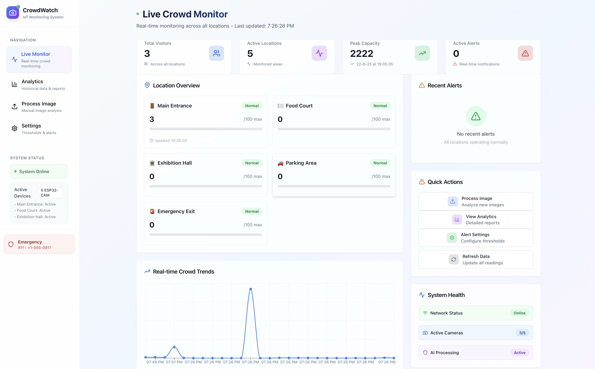

# Crowd Watch Pro  

## Deployment & Resources  
- **Mobile App / Website (Deployed Link):** [Crowd Watch Pro](https://sparkd.base44.app)  
- **Jupyter Notebook (Google Colab Link):** [Notebook Link](https://colab.research.google.com/drive/1wFi053jWkcXHRLWTJ1rutAhd1XuSc6Xm?usp=sharing)  

## Hardware Used  
- ESP32-CAM  
- Charging Module  
- Micro USB Cable  
- Rechargeable Battery  

## Screenshot  
  


---------------------------------------------------------------------


# ESP32-CAM Auto-Capture & Upload for Stall Monitoring

This project turns an ESP32-CAM into an automated monitoring camera. It captures an image at a set interval and uploads it via Wi-Fi to a Python Flask server, which saves the image to a local directory. It's a great starting point for projects like remote stall monitoring, security cameras, or time-lapse photography.

---
## Features
* **Automated Image Capture:** Captures photos every few seconds (interval is configurable in the `index.html` file).
* **Wi-Fi Communication:** The camera communicates with a local server over your Wi-Fi network.
* **Image Server:** A lightweight Python Flask server receives and stores images chronologically.
* **Simple Web UI:** A web-based user interface, served by the ESP32, displays the system status and the most recent capture.

---
## System Architecture
The system consists of two main components that must be on the **same Wi-Fi network**:

1.  **The ESP32-CAM:** This device serves a webpage and acts as a client. The JavaScript on its webpage commands it to capture an image and then sends that image to the Python server's IP address.
2.  **The Python Server:** This application runs on a computer (e.g., a Mac, Windows PC, or Raspberry Pi). It listens for incoming image data at an `/upload` endpoint and saves the files to a local `uploads` folder.


---
## Requirements


### Software
* [Arduino IDE](https://www.arduino.cc/en/software)
* ESP32 Board Support for Arduino IDE
* [Python 3](https://www.python.org/downloads/)
* Flask (`pip install Flask`)

---
## Setup and Installation

Follow these steps in order to get the system running.

### Part 1: The Python Server (The Receiver)

1.  **Install Flask:** Open a terminal or command prompt and run:
    ```bash
    pip3 install Flask
    ```
2.  **Find Your IP Address:** Find your computer's local IP address.
    * **On Mac/Linux:** `ipconfig getifaddr en0` or `hostname -I`
    * **On Windows:** `ipconfig` (Look for the "IPv4 Address" under your Wi-Fi adapter)
    * *Take note of this IP address (e.g., `192.168.1.10`).*

3.  **Run the Server:** In the terminal, navigate to the project directory and run the server:
    ```bash
    python3 server.py
    ```
    Leave this terminal window open. It will now listen for incoming images.

### Part 2: The ESP32-CAM (The Camera)

1.  **Configure the Sketch:**
    * Open the **`CameraWebServer_.ino`** file in the Arduino IDE.
    * Update the file with your Wi-Fi network name and password:
        ```cpp
        const char* ssid = "YOUR_WIFI_NETWORK_NAME";
        const char* password = "YOUR_WIFI_PASSWORD";
        ```
    * Ensure the correct camera model is selected (e.g., `#define CAMERA_MODEL_AI_THINKER`).

2.  **Update the Webpage IP Address:**
    * Open the **`index.html`** file in a text editor.
    * Find the `uploadUrl` variable and replace the placeholder with the IP address of your computer (from Part 1, Step 2). **Remember to include the port number (`:5001`) and the `/upload` path.**
        ```javascript
        // Change this line to your computer's IP address
        const uploadUrl = '[http://192.168.1.10:5001/upload](http://192.168.1.10:5001/upload)';
        ```

3.  **Convert the Webpage:**
    * After saving your changes to `index.html`, you must convert it to a C++ header file.
    * In a terminal, navigate to the folder containing `index.html` and run:
        ```bash
        gzip -c index.html | xxd -i > camera_index.h
        ```

4.  **Upload to ESP32:**
    * Move the newly generated `camera_index.h` file into your Arduino sketch folder, replacing the old one.
    * Connect the ESP32-CAM to your computer via the FTDI programmer.
    * Select the correct board (AI-Thinker ESP32-CAM) and Port in the Arduino IDE.
    * Click **Upload**.

---
## How to Use

1.  Start the Python server on your computer.
2.  Power on the ESP32-CAM.
3.  The ESP32-CAM will automatically connect to your Wi-Fi and begin capturing and sending images.
4.  Check the `uploads` folder on your computer to see the saved images appearing.

## Troubleshooting

* **Q: The Python server won't start and says "Address already in use" or "Port 5000 is in use".**
    * **A:** On macOS, the AirPlay Receiver service often uses port 5000. You can either disable it in System Settings > General > AirDrop & Handoff, or change the port in `server.py` (e.g., to `port=5001`) and make sure to update it in `index.html` as well.

* **Q: The webpage shows a "Not Found" or "Failed to fetch" error.**
    * **A:** This usually means the IP address in `index.html` is incorrect, the ESP32 is not on the same Wi-Fi network as the server, or your computer's firewall is blocking the connection. Double-check the IP and the firewall settings.

## License

This project is licensed under the MIT License. See the `LICENSE` file for details.
