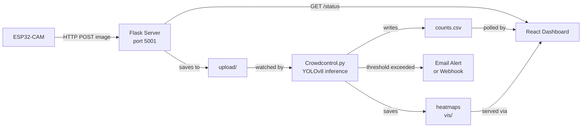

# CrowdWatch — Stall Monitoring System

A crowd monitoring system built around the ESP32-CAM. The camera captures images at a set interval and sends them to a Python backend, which runs a YOLOv8 model to count people and log the data. A React dashboard pulls from that data to show live counts, historical trends, and alerts.

The project came out of a need to monitor footfall at stalls and public spaces without manually checking footage. The whole thing runs on a local network — no cloud required.

---

## Screenshots

**Dashboard**


**Analytics**


**Process Image**


**Settings**


---

## How it works

The ESP32-CAM captures an image every few seconds and uploads it over Wi-Fi to a Flask server running on your computer. A separate Python script (`Crowdcontrol.py`) watches the upload folder and runs YOLOv8 inference on each new image. The count gets written to a CSV file, along with a heatmap visualization. The React dashboard reads from that same server to display everything in real time.


```mermaid
flowchart LR
    A[ESP32-CAM] -->|HTTP POST image| B[Flask Server\nport 5001]
    B -->|saves to| C[upload/]
    C -->|watched by| D[Crowdcontrol.py\nYOLOv8 inference]
    D -->|writes| E[counts.csv]
    D -->|saves| F[heatmaps\nvis/]
    B -->|GET /status| G[React Dashboard]
    E -->|polled by| G
    F -->|served via| G
    D -->|threshold exceeded| H[Email Alert\nor Webhook]
```

---

## Project Structure

```
Stall-Monitoring-Using-ESP-32-main/
|
|-- Arduino Codes/
|   |-- CameraWebServer_/
|   |   `-- CameraWebServer_.ino      # Main sketch — handles capture and upload
|   |-- app_httpd.cpp                 # HTTP handler for the ESP32 web server
|   |-- camera_index.h                # The web UI compressed into a C header
|   |-- camera_pins.h                 # Pin mapping for AI-Thinker board
|   |-- index.html                    # Source HTML served from the camera
|   |-- server.py                     # Basic Flask server for receiving images
|   `-- partitions.csv
|
|-- crowd/
|   |-- Crowdcontrol.py               # Main detection loop (YOLOv8, tiled inference, heatmaps)
|   |-- server.py                     # Flask API (upload, status check, email, webhooks)
|   |-- watch_and_send.py             # Alternative watcher that also sends data to server
|   |-- counts.csv                    # Output log
|   |-- upload/                       # Incoming images
|   `-- CSRNet-pytorch-master/        # CSRNet crowd density model (research/training)
|       |-- model.py
|       |-- train.py
|       |-- dataset.py
|       `-- *.json                    # ShanghaiTech dataset splits
|
`-- app_stall_montior-22/
    `-- crowdwatch-app/               # React frontend
        `-- src/
            |-- pages/
            |   |-- Dashboard.jsx
            |   |-- Analytics.jsx
            |   |-- Upload.jsx
            |   |-- LiveFeed.jsx
            |   `-- Settings.jsx
            |-- components/
            |   |-- dashboard/
            |   |-- analytics/
            |   `-- ui/
            |-- Layout.js
            `-- App.js
```

---

## Hardware

- ESP32-CAM (AI-Thinker, OV2640 camera)
- FTDI programmer (for flashing)
- 3.7V Li-ion battery + charging module
- Micro USB cable

---

## Setup

### Backend (Python)

Requires Python 3.9 or later.

```bash
cd crowd

pip install flask ultralytics opencv-python torch torchvision requests

python server.py
```

The server starts on port 5001. In a second terminal, start the detection loop:

```bash
python Crowdcontrol.py
```

This watches the `upload/` folder and processes each new image as it arrives.

For email alerts, create a `.env` file in the `crowd/` folder:

```
SMTP_EMAIL=your@gmail.com
SMTP_PASSWORD=your_app_password
```

Use a Gmail App Password here, not your account password.

---

### Frontend (React)

Requires Node.js 18 or later.

```bash
cd app_stall_montior-22/crowdwatch-app

npm install
npm start
```

Opens at `http://localhost:3000`.

---

### ESP32 Firmware

Open `Arduino Codes/CameraWebServer_/CameraWebServer_.ino` in the Arduino IDE. Update the Wi-Fi credentials:

```cpp
const char* ssid     = "YOUR_WIFI_SSID";
const char* password = "YOUR_WIFI_PASSWORD";
```

Then open `Arduino Codes/index.html` and set the upload URL to your computer's local IP:

```js
const uploadUrl = 'http://192.168.1.10:5001/upload';
```

After saving, regenerate the header file:

```bash
cd "Arduino Codes"
gzip -c index.html | xxd -i > camera_index.h
```

Move the updated `camera_index.h` into the sketch folder, select the AI-Thinker ESP32-CAM board in Arduino IDE, and upload.

---

## Detection

`Crowdcontrol.py` uses a two-pass approach to handle both large crowds and distant faces:

1. A full-image pass at 1280px gives the model overall scene context.
2. The image is then split into overlapping 640x640 tiles (20% overlap), and each tile is run separately with a lower confidence threshold to catch smaller faces.
3. All detections from both passes are merged and deduplicated with NMS.
4. A Gaussian density heatmap is generated and saved alongside the annotated image.
5. The count, timestamp, and processing time are appended to `counts.csv`.

If the count goes above the configured threshold, an email alert is sent. There's a 5-minute cooldown to avoid spam.

---

## API

| Method | Endpoint | What it does |
|---|---|---|
| POST | `/upload` | Receive an image (from ESP32 or manual upload) |
| GET | `/status/<filename>` | Returns processing status, count, and heatmap URL |
| GET | `/vis/<filename>` | Serves a processed visualization image |
| POST | `/send-email` | Sends an alert email via Gmail SMTP |
| POST | `/send-webhook` | Posts an alert to a Slack or Discord webhook |

---

## Settings / Config

The main knobs in `Crowdcontrol.py`:

| Setting | Default | Notes |
|---|---|---|
| `ALERT_THRESHOLD` | 400 | Count above this triggers an alert |
| `ALERT_COOLDOWN` | 300 | Seconds between repeat alerts |
| `MODEL_PATH` | yolov8l.pt | Swap for a smaller model if needed (yolov8n.pt is faster) |
| `CONF_THRES_GLOBAL` | 0.25 | Confidence for the full image pass |
| `CONF_THRES_TILE` | 0.15 | Lower threshold for tiles (catches more at a distance) |
| `IOU_THRES` | 0.6 | NMS threshold for merging detections |
| `SLICE_HEIGHT/WIDTH` | 640 | Tile size |
| `OVERLAP_*_RATIO` | 0.2 | 20% tile overlap to avoid missed detections at borders |

---

## Troubleshooting

**Port 5001 in use**

```bash
lsof -i :5001 | grep LISTEN
kill -9 <PID>
```

On macOS, port 5000 is often taken by AirPlay. The server is already configured for 5001, but if that's also busy, just change the port in `server.py` and `index.html`.

**ESP32 can't reach the server**

Make sure the ESP32 and your computer are on the same Wi-Fi network. Check the IP in `index.html` matches your machine's current IP (`ipconfig getifaddr en0` on Mac). If it still fails, check whether your firewall is blocking port 5001.

**YOLOv8 model not found**

The model downloads automatically on first run. If you're offline, run this once with internet access:

```bash
python -c "from ultralytics import YOLO; YOLO('yolov8l.pt')"
```

---

## Tech Stack

- Hardware: ESP32-CAM (AI-Thinker)
- Firmware: Arduino C++
- AI: YOLOv8 via Ultralytics, OpenCV, PyTorch
- Backend: Python, Flask
- Frontend: React, Tailwind CSS, Recharts, Framer Motion, Radix UI
- Notifications: Gmail SMTP, Slack/Discord webhooks

---

## Resources

- Live app: https://sparkd.base44.app
- Colab notebook (CSRNet training): https://colab.research.google.com/drive/1wFi053jWkcXHRLWTJ1rutAhd1XuSc6Xm?usp=sharing
- YOLOv8 docs: https://docs.ultralytics.com
- Arduino IDE: https://www.arduino.cc/en/software

---

## License

MIT — see [LICENSE](LICENSE).
